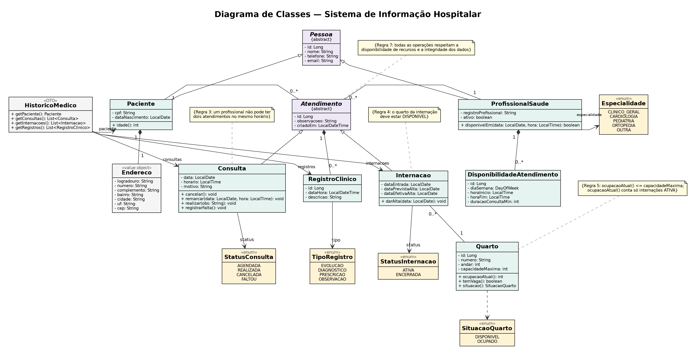

# 🏥 Sistema Hospitalar

Projeto de sistema hospitalar desenvolvido como trabalho prático da disciplina de Programação Modular

---

## 💡 Objetivo

Desenvolver um Sistema de Informação Hospitalar para gerenciar as operações de um hospital, centralizando informações de pacientes, profissionais da saúde, consultas, internações e quartos.

O sistema será desenvolvido utilizando conceitos de Programação Orientada a Objetos (POO), arquitetura em camadas, API REST com Spring Boot, persistência de dados, tratamento de exceções e testes automatizados.

---

## 👥 Alunos Integrantes

- Nicolas De Almeida
- Diogo Gouvêa Bastos Braga
- Rafael Galileu Thales Oliveira
- 

## 🌐 Tecnologias

- Java
- HTML
- CSS
- Spring Boot
- Spring Data JPA
- MySQL
- Maven

---

## 🎯 Funcionalidades

- Gerenciamento de pacientes
- Gerenciamento de profissionais da saúde
- Agendamento e controle de consultas
- Controle de internações
- Gerenciamento de quartos hospitalares
- Controle de disponibilidade de atendimento
- Registro do hist´orico de atendimentos dos pacientes
- Consulta de informa¸c˜oes m´edicas e administrativas

---

## ❗️ Regras de Negócio

1. Um paciente poderá possuir diversas consultas e internações ao longo do tempo.
2. Consultas deverão estar associadas a um profissional da saúde responsável e a um paciente.
3. Um profissional não poderá possuir dois atendimentos agendados para o mesmo horário.
4. Uma internação deverá estar associada a um paciente e a um quarto disponível.
5. Um quarto não poderá ultrapassar sua capacidade máxima de ocupação.
6. O sistema deverá manter o histórico de consultas e internações dos pacientes.
7. Todas as operações realizadas deverão respeitar as regras de disponibilidade de recursos e integridade dos dados.

---

## 🎯 Características e Requisitos do Sistema

### Paciente

O sistema deverá armazenar:

- Nome
- CPF
- Data de nascimento
- Telefone
- Endereço
- E-mail para contato

### Profissional da Saúde

O sistema deverá armazenar:

- Nome
- Registro profissional
- Especialidade
- Telefone
- E-mail para contato

### Consulta

Uma consulta deverá possuir:

- Paciente
- Profissional responsável
- Data
- Horário
- Motivo da consulta
- Observações médicas

### Internação

Uma internação deverá possuir:

- Paciente
- Profissional responsável
- Quarto
- Data de entrada
- Data prevista de alta
- Data efetiva de alta
- Observações

### Quarto

Um quarto deverá possuir:

- Número de identificação
- Andar
- Capacidade máxima de pacientes
- Situação atual (disponível ou ocupado)

### Histórico Médico

O sistema deverá permitir consultar o histórico de um paciente contendo:

- Consultas realizadas
- Internações realizadas
- Informações relevantes registradas durante os atendimentos

---

## 📊 Diagrama de Classes

Abaixo encontra-se o diagrama de classes UML com a modelação estrutural do sistema:

---

## Cartões CRC

Os cartões CRC (Classe – Responsabilidade – Colaboração) mostram, de forma simples, o que cada classe do sistema faz e com quais outras classes ela precisa trabalhar.

## Caso de Uso: Gerenciar Pacientes

### Paciente

| Responsabilidades | Colaborações |
|---|---|
| 1. Conhecer seu nome 2. Conhecer seu CPF 3. Conhecer sua data de nascimento 4. Conhecer seu telefone 5. Conhecer seu endereço 6. Conhecer seu e-mail de contato 7. Conhecer suas consultas 8. Conhecer suas internações 9. Conhecer seu histórico médico | Consulta Internação Histórico Médico |

## Caso de Uso: Gerenciar Profissionais da Saúde

### Profissional da Saúde

| Responsabilidades | Colaborações |
|---|---|
| 1. Conhecer seu nome 2. Conhecer seu registro profissional 3. Conhecer sua especialidade 4. Conhecer seu telefone 5. Conhecer seu e-mail de contato 6. Conhecer suas consultas agendadas 7. Conhecer as internações sob sua responsabilidade 8. Verificar se está disponível em um horário | Consulta Internação |

## Caso de Uso: Agendar Consulta

### Consulta

| Responsabilidades | Colaborações |
|---|---|
| 1. Conhecer seu paciente 2. Conhecer seu profissional responsável 3. Conhecer sua data 4. Conhecer seu horário 5. Conhecer o motivo da consulta 6. Conhecer suas observações médicas 7. Registrar observações médicas 8. Verificar se o profissional está disponível no horário | Paciente Profissional da Saúde |

## Caso de Uso: Controlar Internação

### Internação

| Responsabilidades | Colaborações |
|---|---|
| 1. Conhecer seu paciente 2. Conhecer seu profissional responsável 3. Conhecer seu quarto 4. Conhecer sua data de entrada 5. Conhecer sua data prevista de alta 6. Conhecer sua data efetiva de alta 7. Conhecer suas observações 8. Verificar se o quarto tem vaga antes de internar 9. Registrar a alta do paciente | Paciente Profissional da Saúde Quarto |

### Quarto

| Responsabilidades | Colaborações |
|---|---|
| 1. Conhecer seu número de identificação 2. Conhecer seu andar 3. Conhecer sua capacidade máxima de pacientes 4. Conhecer sua situação atual (disponível ou ocupado) 5. Conhecer a quantidade de pacientes internados nele 6. Verificar se há vaga disponível 7. Atualizar sua situação conforme a ocupação | Internação |

## Caso de Uso: Consultar Histórico Médico

### Histórico Médico

| Responsabilidades | Colaborações |
|---|---|
| 1. Conhecer seu paciente 2. Conhecer as consultas realizadas do paciente 3. Conhecer as internações realizadas do paciente 4. Conhecer as informações relevantes registradas nos atendimentos 5. Fornecer o histórico completo do paciente | Paciente Consulta Internação |

---

## 🚦 Status

🧱 Em desenvolvimento.
